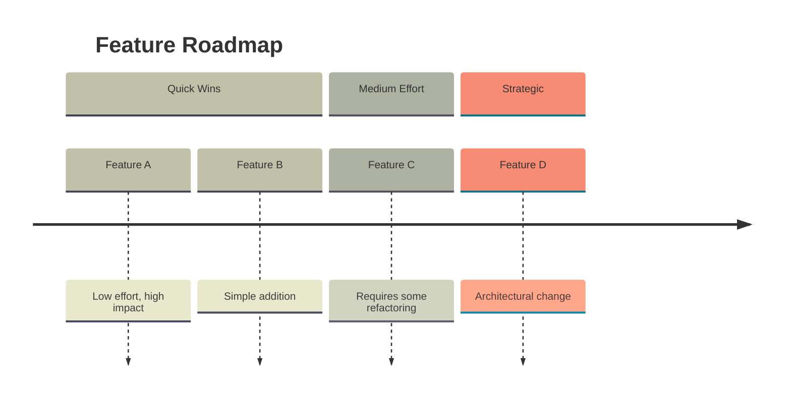
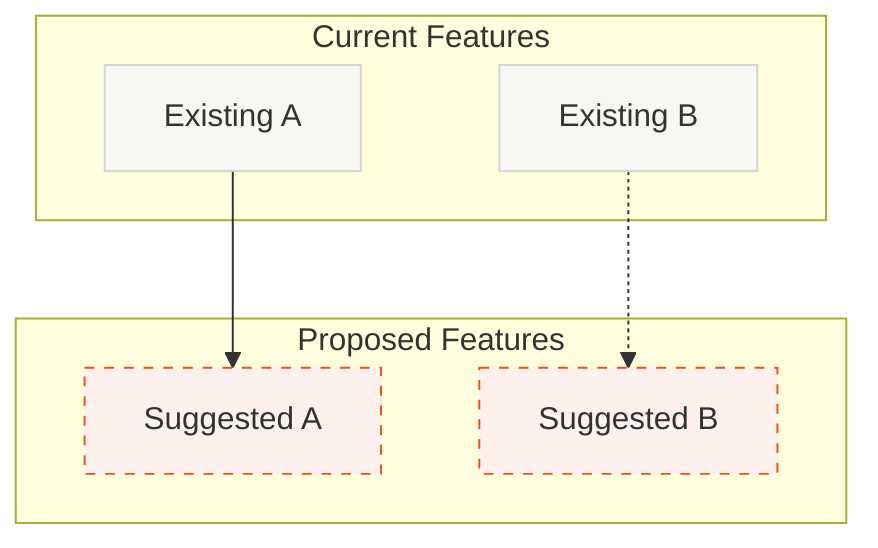

# Roadmap: Feature & Improvement Suggestions

**Source of truth:** `docs/ROADMAP.md`. Always read it first. Build on top of it; do not replace it.

Analyze the codebase against the existing roadmap. Validate completeness, detect staleness, and surface infrastructure items that complement the strategic roadmap. Track progress with todos.

## Todo List

Create these todos with `todo_write` and update as you go:

1. Read `docs/ROADMAP.md` and internalize phases, launch hardening, competitive gaps
2. Scan codebase to validate roadmap status (what's implemented vs claimed ✓)
3. Identify staleness: roadmap items marked complete but missing, or implemented but not marked
4. Surface infrastructure/health items that support the strategic roadmap
5. Create timeline diagram (phased overview) grounded in docs/ROADMAP.md
6. Create current vs proposed flowchart (integration points)
7. Ask user which features to plan

## Analysis Focus

**Primary:** Align with `docs/ROADMAP.md`. Use its phases, priorities, and sequencing. The roadmap command extends—not replaces—the strategic doc.

**Validation (staleness check):**
- Items marked ✓ in roadmap: verify they exist in code (APIs, UI, tables, config)
- Launch hardening items: confirm implementation status
- Competitive Gaps P0–P4: note which are done vs pending

**Infrastructure layer (additions):** Items that support the roadmap but aren't in it:
- Missing common patterns (auth, caching, error handling, logging)
- Developer experience (ESLint, structured logging, error boundaries)
- Code quality that blocks launch hardening (oversized files, dependency vulnerabilities)

## Diagram 1: Timeline Overview

A phased roadmap showing features by effort level. **Source:** `docs/ROADMAP.md` phases + infrastructure items.

- Sections: use roadmap structure (e.g. Launch Hardening, Competitive Gaps P0, Infrastructure)
- Or by effort: Quick Wins, Medium Effort, Strategic — when mapping infrastructure items
- Group related features within each phase
- Colors: warm neutrals with themed variables

## Diagram 2: Current vs Proposed Flowchart

Visual distinction between existing and suggested features. **Source:** roadmap phases marked complete = Current; Launch Hardening / Competitive Gaps / Infrastructure = Proposed.

- Solid borders (#F7F7F4, #D4D4D0): existing features (from roadmap)
- Dashed orange borders (#FEF0ED, #F34F1D): proposed features
- Solid arrows: direct dependencies
- Dashed arrows: suggested connections

## Output

Render directly in chat (don't write files):

1. **Roadmap status** — Summary of `docs/ROADMAP.md` phases and where the codebase stands. Call out any staleness (roadmap says ✓ but code disagrees, or vice versa).
2. **Prioritized list** — 5–8 items: mix of (a) next items from the strategic roadmap (Launch Hardening, Competitive Gaps P0, etc.) and (b) infrastructure items that unblock or support them. Rationale for each.
3. **Timeline diagram** — Phased overview. Use roadmap phases (Launch Hardening, Competitive Gaps, Infrastructure) as sections. Populate with concrete items from the prioritized list.
4. **Current vs Proposed flowchart** — Existing features (from roadmap phases marked complete) vs proposed (next roadmap items + infrastructure). Show integration points.
5. **Staleness notes** — If any roadmap items need status updates, list them. Suggest: "Consider updating docs/ROADMAP.md to mark X as complete" or "Roadmap claims Y is done; code suggests otherwise."
6. Ask: "Would you like me to create a plan for any of these features, or update docs/ROADMAP.md?"

## Mermaid Syntax

- Timeline sections: `section Name`
- Subgraphs: `subgraph ID["Name"]`
- Dashed lines: `A -.-> B`
- Dashed borders: `stroke-dasharray:5 5`
- Special chars need quotes: `A["@scope/pkg"]`
